# 🧜 Mermaid-Flowchart

Cheat Sheet for Mermaid.

## 1. Flowcharts

A flowchart is a type of diagram that represents an algorithm, workflow or process. The flowchart shows the steps as boxes of various kinds, and their order by connecting the boxes with arrows. This diagrammatic representation illustrates a solution model to a given problem.

### 1.1 Graph

Possible directions are:

* `TB` - top bottom
* `BT` - bottom top
* `RL` - right left
* `LR` - left right
* `TD` - same as TB


<table><thead><tr><th width="150.33333333333331">Direction</th><th width="329">Diagram</th><th>Definition</th></tr></thead><tbody><tr><td>TB</td><td></td><td><pre class="language-mermaid" data-full-width="true"><code class="lang-mermaid">graph TB;
    A-->B;
</code></pre></td></tr><tr><td>BT</td><td></td><td><pre class="language-mermaid"><code class="lang-mermaid">graph BT;
    A-->B;
</code></pre></td></tr><tr><td>RL</td><td></td><td><pre class="language-mermaid"><code class="lang-mermaid">graph RL;
    A-->B;
</code></pre></td></tr><tr><td>LR</td><td></td><td><pre class="language-mermaid"><code class="lang-mermaid">graph LR;
    A-->B;
</code></pre></td></tr><tr><td>TD</td><td></td><td><pre class="language-mermaid"><code class="lang-mermaid">graph TD;
    A-->B;
</code></pre></td></tr></tbody></table>

### 1.2 Nodes & shapes

<table data-full-width="true"><thead><tr><th width="174.66666666666663">Feature</th><th width="309">Diagram</th><th>Definition</th></tr></thead><tbody><tr><td>Node(Default)</td><td></td><td>8a37b9ee03f84af584d9b57b1aac8f69</td></tr><tr><td>Node with Text</td><td></td><td><pre class="language-mermaid"><code class="lang-mermaid">graph LR;
    id1[This is the text in the box]
</code></pre></td></tr><tr><td>Node with Round Edges</td><td></td><td><pre><code>graph LR;
    id1(This is the text in the box)
</code></pre></td></tr><tr><td>Node in Circle Form</td><td></td><td><pre class="language-mermaid"><code class="lang-mermaid">graph LR;
    id1((This is the text in the circle))
</code></pre></td></tr><tr><td>Node in Asymmetric Shape</td><td></td><td><pre class="language-mermaid"><code class="lang-mermaid">graph LR;
    id1>This is the text in the box]
</code></pre></td></tr><tr><td>Node in Rhombus Form</td><td></td><td><pre class="language-mermaid"><code class="lang-mermaid">graph LR;
    id1{This is the text in the box}
</code></pre></td></tr></tbody></table>

### 1.3 Links Between Nodes

<table><thead><tr><th>Feature</th><th>Diagram</th><th>Definition</th></tr></thead><tbody><tr><td>Link with Arrow Head</td><td>graph LR;A-->B</td><td><pre class="language-mermaid"><code class="lang-mermaid">graph LR;
    A-->B
</code></pre></td></tr><tr><td>Open Link</td><td>graph LR;A---B</td><td><pre class="language-mermaid"><code class="lang-mermaid">graph LR;
    A---B
</code></pre></td></tr><tr><td>Text on Links(1)</td><td>graph LR;A-- This is the text ---B</td><td><pre class="language-mermaid"><code class="lang-mermaid">graph LR;
    A-- This is the text ---B
</code></pre></td></tr><tr><td>Text on Links(2)</td><td>graph LR;A---|This is the text|B</td><td><pre class="language-mermaid"><code class="lang-mermaid">graph LR;
    A---|This is the text|B
</code></pre></td></tr><tr><td>Link with Arrow Head and Text(1)</td><td>graph LR;A-->|text|B</td><td><pre class="language-mermaid"><code class="lang-mermaid">graph LR;
    A-->|text|B
</code></pre></td></tr><tr><td>Link with Arrow Head and Text(2)</td><td>graph LR;A-- text -->B</td><td><pre class="language-mermaid"><code class="lang-mermaid">graph LR;
    A-- text -->B
</code></pre></td></tr><tr><td>Dotted Link</td><td>graph LR;A-.->B;</td><td><pre class="language-mermaid"><code class="lang-mermaid">graph LR;
    A-.->B;
</code></pre></td></tr><tr><td>Dotted Link with Text</td><td>graph LR;A-. text .-> B</td><td><pre class="language-mermaid"><code class="lang-mermaid">graph LR;
    A-. text .-> B
</code></pre></td></tr><tr><td>Thick Link</td><td>graph LR;A ==> B</td><td><pre class="language-mermaid"><code class="lang-mermaid">graph LR;
    A ==> B
</code></pre></td></tr><tr><td>Thick link with text</td><td>graph LR;A == text ==> B</td><td><pre class="language-mermaid"><code class="lang-mermaid">graph LR;
    A == text ==> B
</code></pre></td></tr></tbody></table>

### 1.4 Subgraphs

Syntax:

```markdown
subgraph title
    graph definition
end
```

Example:

```markdown
graph TB
    c1-->a2
    subgraph one
    a1-->a2
    end
    subgraph two
    b1-->b2
    end
    subgraph three
    c1-->c2
    end
```


## 4. Demos

### 4.1 Basic Flowchart


***

### 4.2 Flowchart with Decision

```raw
graph TD
    A[Christmas] -->|Get money| B(Go shopping)
    B --> C{Let me think}
    C -->|One| D[Laptop]
    C -->|Two| E[iPhone]
    C -->|Three| F[fa:fa-car Car]
```


***

### 4.3 Larger Flowchart with Some Styling

```markdown
graph TB
    sq[Square shape] --> ci((Circle shape))

    subgraph A
        od>Odd shape]-- Two line<br/>edge comment --> ro
        di{Diamond with <br/> line break} -.-> ro(Rounded<br>square<br>shape)
        di==>ro2(Rounded square shape)
    end

    %% Notice that no text in shape are added here instead that is appended further down
    e --> od3>Really long text with linebreak<br>in an Odd shape]

    %% Comments after double percent signs
    e((Inner / circle<br>and some odd <br>special characters)) --> f(,.?!+-*ز)

    cyr[Cyrillic]-->cyr2((Circle shape Начало));

     classDef green fill:#9f6,stroke:#333,stroke-width:2px
     classDef orange fill:#f96,stroke:#333,stroke-width:4px
     class sq,e green
     class di orange
```



```mermaid
graph TB
    sq[Square shape] --> ci((Circle shape))

    subgraph A
        od>Odd shape]-- Two line<br/>edge comment --> ro
        di{Diamond with <br/> line break} -.-> ro(Rounded<br>square<br>shape)
        di==>ro2(Rounded square shape)
    end

    %% Notice that no text in shape are added here instead that is appended further down
    e --> od3>Really long text with linebreak<br>in an Odd shape]

    %% Comments after double percent signs
    e((Inner / circle<br>and some odd <br>special characters)) --> f(,.?!+-\*ز)

    cyr[Cyrillic]-->cyr2((Circle shape Начало));

     classDef green fill:#9f6,stroke:#333,stroke-width:2px
     classDef orange fill:#f96,stroke:#333,stroke-width:4px
     class sq,e green
     class di orange
```

## 5. References

* [Mermaid Flowcharts - Basic Syntax](https://mermaidjs.github.io/#/flowchart)
* [Mermaid Sequence diagrams](https://mermaidjs.github.io/#/sequenceDiagram)
* [Mermaid Gant diagrams](https://mermaidjs.github.io/#/gantt)

