# 🧜‍♀️ Mermaid-Sequence

> Cheat Sheet for Mermaid.

## 2. Sequence Diagrams

A Sequence diagram is an interaction diagram that shows how processes operate with one another and in what order.

***

### 2.1 Participants

The participants or actors are rendered in order of appearance in the diagram source text.

<table data-full-width="true"><thead><tr><th>Feature</th><th>Diagram</th><th></th></tr></thead><tbody><tr><td>You can specify the actor's order of appearance to<br>show the participants in a different order.</td><td></td><td><pre><code>sequenceDiagram
    participant Alice
    participant John
    Alice->>John: John, how are you?
    John-->>Alice: Great!
</code></pre></td></tr><tr><td>You can specify the actor’s order of appearance<br>to show the participants in a different order.</td><td></td><td><pre><code>sequenceDiagram
    Alice->>John: John, how are you?
    John-->>Alice: Great!

            
</code></pre></td></tr><tr><td>The participants can be defined implicitly without<br>specifying them with the `participant` keyword.</td><td></td><td><pre><code>sequenceDiagram
    Alice->>John: John, how are you?
    John-->>Alice: Great!

            
</code></pre></td></tr></tbody></table>

***

### 2.2 Aliases

The participant can have a convenient identifier and a descriptive label.

```markdown
sequenceDiagram
    participant A as Alice
    participant J as John
    A->>J: Hello John, how are you?
    J-->>A: Great!
```


***

### 2.3 Messages

Messages can be of two displayed either solid or with a dotted line.

```raw
[Actor][Arrow][Actor]:Message text
```

There are six types of arrows currently supported:

| Arrow Type | Description                                 |
| ---------- | ------------------------------------------- |
| ->         | Solid line without arrow                    |
| -->        | Dotted line without arrow                   |
| ->>        | Solid line with arrowhead                   |
| -->>       | Dotted line with arrowhead                  |
| -x         | Solid line with a cross at the end (async)  |
| --x        | Dotted line with a cross at the end (async) |

### 2.4 Activations

<table><thead><tr><th>Feature</th><th>Diagram</th><th></th></tr></thead><tbody><tr><td>Activate and deactivate an actor.</td><td></td><td><pre><code>sequenceDiagram
    Alice->>John: Hello John, how are you?
    activate John
    John-->>Alice: Great!
    deactivate John
            
</code></pre></td></tr><tr><td>Shortcut notation by appending `+/-` suffix to the message arrow.</td><td></td><td><pre><code>sequenceDiagram
    Alice->>+John: Hello John, how are you?
    John-->>-Alice: Great!
            
</code></pre></td></tr><tr><td>Activations can be stacked for same actor:</td><td></td><td><pre><code>sequenceDiagram
    Alice->>+John: Hello John, how are you?
    Alice->>+John: John, can you hear me?
    John-->>-Alice: Hi Alice, I can hear you!
    John-->>-Alice: I feel great!
            
</code></pre></td></tr></tbody></table>

### 2.5 Notes

Add notes to a sequence diagram by the notation `Note`.

```raw
Note [ right of | left of | over ] [Actor]: Text in note content
```

1. Right Side

```markdown
sequenceDiagram
    participant John
    Note right of John: Text in note
```


2. Left Side

```markdown
sequenceDiagram
    participant John
    Note left of John: Text in note
```


3. Over

```markdown
sequenceDiagram
    participant John
    Note over John: Text in note
```


4. Create notes spanning two participants

```markdown
sequenceDiagram
    Alice->>John: Hello John, how are you?
    Note over Alice,John: A typical interaction
```


### 2.6 Loops

Express loops in a sequence diagram by the notation `loop`.

```markdown
loop Loop text
... statements ...
end
```


```markdown
sequenceDiagram
    Alice->John: Hello John, how are you?
    loop Every minute
        John-->Alice: Great!
    end
```

### 2.7 Alt

Express alternative paths in a sequence diagram by the notation `alt`.

```markdown
alt Describing text
... statements ...
else
... statements ...
end
```

Or, if there is sequence that is optional (if without else).

```markdown
opt Describing text
... statements ...
end
```

Example:

```markdown
sequenceDiagram
    Alice->>John: Hello John, how are you?
    alt is sick
        John->>Alice: Not so good :(
    else is well
        John->>Alice: Feeling fresh like a daisy
    end
    opt Extra response
        John->>Alice: Thanks for asking
    end
```


## 4. Demos

```mermaid
graph TB
    sq[Square shape] --> ci((Circle shape))

    subgraph A
        od>Odd shape]-- Two line<br/>edge comment --> ro
        di{Diamond with <br/> line break} -.-> ro(Rounded<br>square<br>shape)
        di==>ro2(Rounded square shape)
    end

    %% Notice that no text in shape are added here instead that is appended further down
    e --> od3>Really long text with linebreak<br>in an Odd shape]

    %% Comments after double percent signs
    e((Inner / circle<br>and some odd <br>special characters)) --> f(,.?!+-\*ز)

    cyr[Cyrillic]-->cyr2((Circle shape Начало));

     classDef green fill:#9f6,stroke:#333,stroke-width:2px
     classDef orange fill:#f96,stroke:#333,stroke-width:4px
     class sq,e green
     class di orange
```



#### 4.4 Basic Sequence Diagram

```raw
sequenceDiagram
    Alice ->> Bob: Hello Bob, how are you?
    Bob-->>John: How about you John?
    Bob--x Alice: I am good thanks!
    Bob-x John: I am good thanks!
    Note right of John: Bob thinks a long<br/>long time, so long<br/>that the text does<br/>not fit on a row.

    Bob-->Alice: Checking with John...
    Alice->John: Yes... John, how are you?
```


#### 4.5 Message to Self in Loop

```raw
sequenceDiagram
    participant Alice
    participant Bob
    Alice->>John: Hello John, how are you?
    loop Healthcheck
        John->>John: Fight against hypochondria
    end
    Note right of John: Rational thoughts<br/>prevail...
    John-->>Alice: Great!
    John->>Bob: How about you?
    Bob-->>John: Jolly good!
```


## 5. References

* [Mermaid Flowcharts - Basic Syntax](https://mermaidjs.github.io/#/flowchart)
* [Mermaid Sequence diagrams](https://mermaidjs.github.io/#/sequenceDiagram)
* [Mermaid Gant diagrams](https://mermaidjs.github.io/#/gantt)
