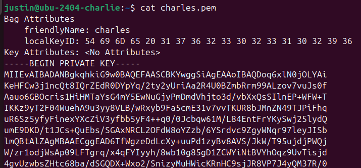
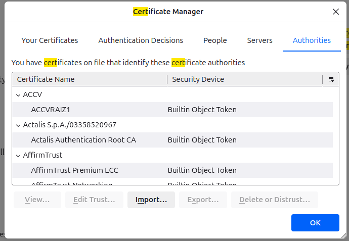
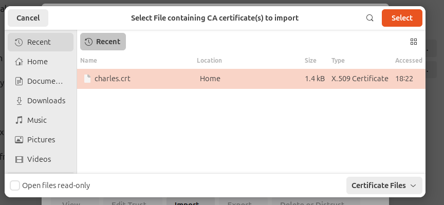
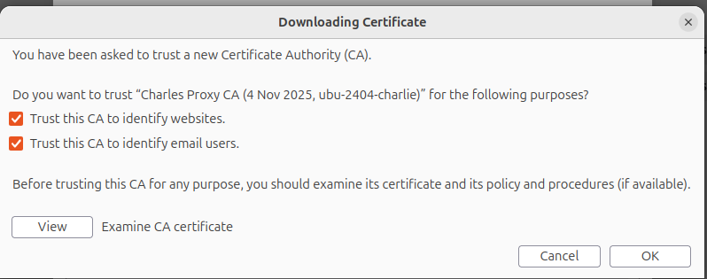
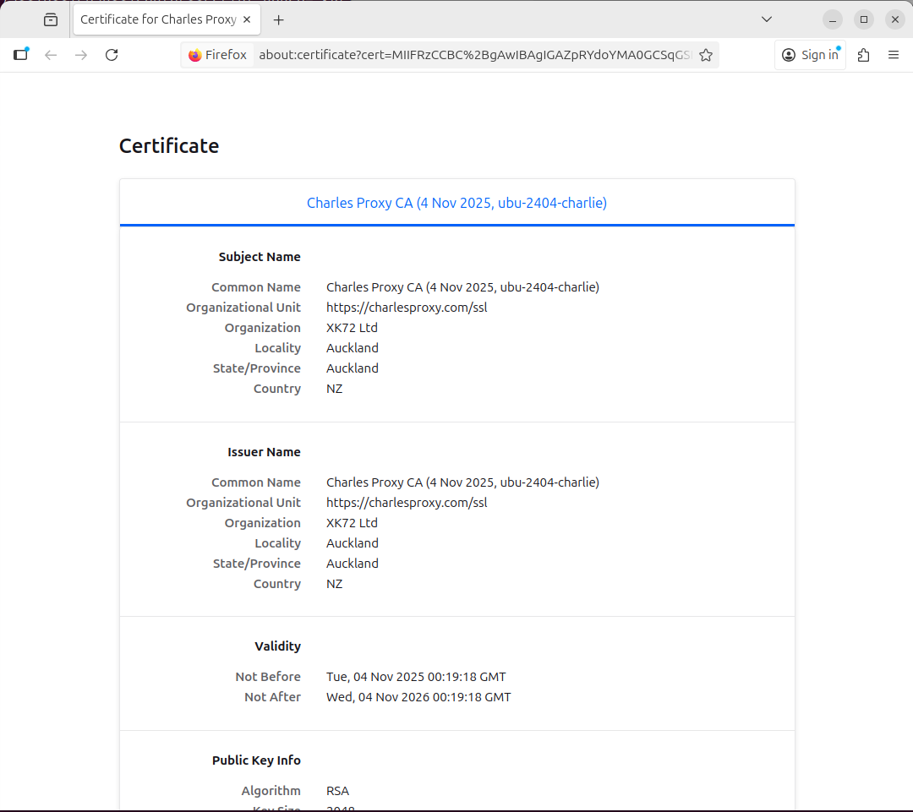
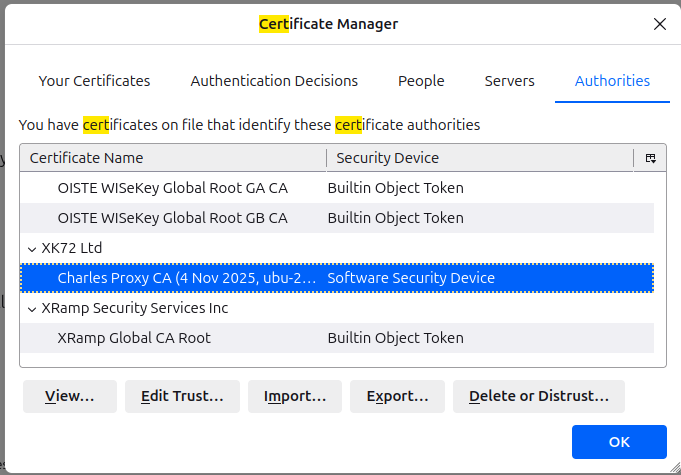
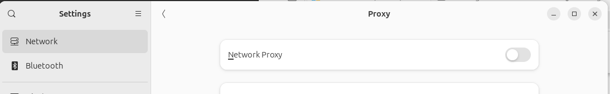

# Setup Charles Proxy on Ubuntu

### ✅ **1. Install Charles Proxy**

* Download the Linux version from https://www.charlesproxy.com/download/.
* Install using your package manager or by extracting the tarball:Shelltar -xvf charles-proxy-\<version>.tar.gzcd charles-proxy./charles
* Ensure Java is installed (Charles runs on Java).

or:

```sh
wget -qO- https://www.charlesproxy.com/packages/apt/charles-repo.asc | sudo tee /etc/apt/keyrings/charles-repo.asc
sudo sh -c 'echo deb [signed-by=/etc/apt/keyrings/charles-repo.asc] https://www.charlesproxy.com/packages/apt/ charles-proxy main > /etc/apt/sources.list.d/charles.list'
sudo apt-get update && sudo apt-get install charles-proxy5

```

***

### ✅ **2. Enable SSL Proxying**

* Open Charles and go to: **Proxy → SSL Proxying Settings → Enable SSL Proxying**.\
  \
  \

* Click **Add** and enter:
  * **Host:** `*` (wildcard for all hosts)
  * **Port:** `443`&#x20;

<figure><figcaption></figcaption></figure>

\
\


* This ensures all HTTPS traffic is decrypted.charlesproxy

<figure><figcaption></figcaption></figure>

***

### ✅ **3. Install Charles Root Certificate on Linux**

#### Export the Root cert & priv key

* In Charles, go to: **Help → SSL Proxying → Export Charles Root Certificate and private key**.

<figure><figcaption></figcaption></figure>

* set a password you can remember - only need it for a short while

<figure><figcaption></figcaption></figure>

* Name the file charles.p12

<figure><figcaption></figcaption></figure>

#### Convert the p12 file to PEM

* A `.p12` files have both halves of the key embedded, so that administrators can easily manage halves of keys - but it is encoded, so you can't really read it. Lets convert it to a pem

```
openssl pkcs12 -in charles.p12 -out charles.pem -nodes
```

> Note: it will prompt you for that password we created before:&#x20;

<figure><figcaption></figcaption></figure>

* now when we try to inspect the newly exported .pem file, it will have a public and private key that is readable:

```sh
cat charles.pem
```

<figure><figcaption></figcaption></figure>

> `.pem` files are generally the public key, used by the client to verify and decrypt data sent by servers. PEM files could also be encoded private keys, so check the content if you're not sure.

#### Optional: If you messed up your cert chain and have crap in the keychain, we can reset it.

```sh
## goto the cert store
cd /usr/local/share/ca-certificates

# remove any certs lurking that you don't want - example charles-junk.crt
sudo rm charles-junk.crt

# this folder should be totally empty (if your building from scratch). 

# Lets check whats in the keychain - you might see some garbage at the end of 
# the file if you were trying to import a raw crt instead of pem in 
# crt format
sudo cat /etc/ssl/certs/ca-certificates.crt

## Now lets run the command to clear the trust chain
sudo update-ca-certificates --fresh
```

#### Move the cert & make it trusted

Now we need to move this file & make it trusted. When installing the cert into the trusted chain, its going to want it on the crt format (non-encoded)

```sh
# Copy the file to the /usr/local/share/ca-certificates
sudo cp charles.pem /usr/local/share/ca-certificates

# for what i assume is a good reason, we have to reformat the 
# .pem as a crt - so we just rename
sudo mv charles.pem charles.crt

# now lets run the utility that will load it into the root trust
sudo update-ca-certificates
```

> **update-ca-certificates** is a program that updates the directory **/etc/ssl/certs** to hold **SSL certificates** and generates **ca-certificates.crt**, a concatenated **single-file list** of **certificates**.\
> Source: [https://manpages.ubuntu.com/manpages/xenial/man8/update-ca-certificates.8.html](https://manpages.ubuntu.com/manpages/xenial/man8/update-ca-certificates.8.html)

#### Setup the proxy:

For comandline tools that use the environment variables to configure the proxy, lets update the http\_proxy env variable

```sh
export http_proxy="http://127.0.0.1:8888"
export https_proxy="http://127.0.0.1:8888"
```

For other apps that use the system proxy, we can setup the system proxy

* Goto settings -> Network -> Network Proxy

<figure><figcaption></figcaption></figure>

## 🤪Lets do the thing! Run Charles!

go back to terminal and lets launch charles

```sh
charles
```

and it should look pretty empty without anything going on.

<figure><figcaption></figcaption></figure>

#### Now lets do the thing!

Now if i go back to my command line and hit a few urls, I should now see a bunch of gobbledygook that will be the raw HTML that is being returned from a request.

```sh
## Unencrypted http call
curl http://www.google.com

### using HTTPS 
curl https://www.google.com 
```

<figure><figcaption></figcaption></figure>

Now if I go look at Charles, I should see two entries&#x20;

* One for the http traffic

<figure><figcaption></figcaption></figure>

* One for the HTTPS traffic - not the Protocol difference, esp the SSL section

<figure><figcaption></figcaption></figure>

## 🌐4. Web Browser Configuration

Now if you're the kinda fella (or misses) that wants to use a browser, if you launch firefox, you might see something like:

<figure><figcaption></figcaption></figure>

If we goto settings, and search for "cert" in the dialog, you'll see Certificates settings pop up. Simply clicky the "**View Certificates**" button

<figure><figcaption></figcaption></figure>

* And now you'll see the various root certs. lets import our fancy cert we generaeted. Click "**Import**"

<figure><figcaption></figcaption></figure>

This will pull up the file dialog, and go ahead and select the charles.crt file we previously used and select, well "**select**"

<figure><figcaption></figcaption></figure>

* Then you'll want to checky the boxes so you can trust the heck out of this cert!

<figure><figcaption></figcaption></figure>

* If you are the enquiring type, go ahead and hit "view" if you want to check out that bad boy cert!

<figure><figcaption></figcaption></figure>

* Otherwise go ahead and scroll down and you'll see our fancy new cert listed. Hit "**OK**" when you are ready to get back into it

<figure><figcaption></figcaption></figure>

* Now if you go back to your browser and reload, you should see that everything is right as rain:

<figure><figcaption></figcaption></figure>

## 🔥5. OMG! It's on fire! turn it off, turn it off!

1. Calm yourself
2. undo the proxy settings in the system by running

```sh
unset https_proxy
unset http_proxy
```

3. System Proxy: Now lets go back to Settings-->Network->Proxy, and we can disable

<figure><figcaption></figcaption></figure>

4. **Remove all the Imported certs & root trust**

```sh
## goto the cert store
cd /usr/local/share/ca-certificates

# remove any certs lurking that you don't want - example charles-junk.crt
sudo rm charles-junk.crt

# this folder should be totally empty (if your building from scratch). 
ls 

# Lets check whats in the keychain - you might see some garbage at the end of 
# the file if you were trying to import a raw crt instead of pem in 
# crt format
sudo cat /etc/ssl/certs/ca-certificates.crt

## Now lets run the command to clear the trust chain
sudo update-ca-certificates --fresh
```

\---

**⚠️ Security Note**

Only use SSL proxying in controlled environments. Intercepting traffic without consent can be illegal and unethical.
